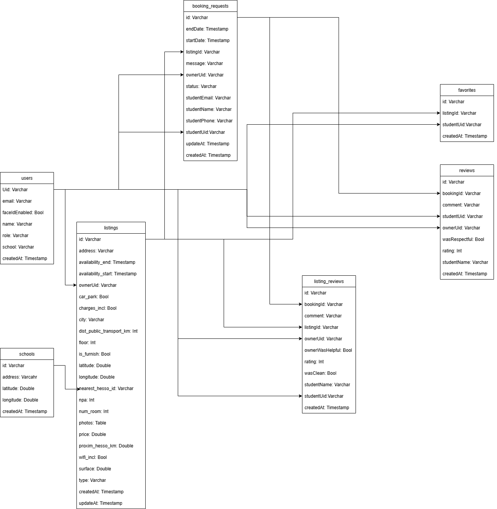

# HEStimate — Technical Guide

## 1. Overview

HEStimate is a **student-housing marketplace** that connects students with property owners.  
It consists of a **Flutter frontend**, a **FastAPI backend**, and **Firebase services** for authentication, storage, and database.  

The app enables:  
- 🔑 **Authentication** — Email/Password & optional Face ID  
- 🏠 **Listings** — Create, browse, filter, and manage accommodations  
- 💰 **Price Estimation** — AI-powered rent prediction  
- 📍 **Convenience Info** — Campus & transport distances  
- ⭐ **Reviews** — Feedback between students and owners  

---

## 2. Architecture

### 2.1 System Architecture

**Components**
- **Frontend (Flutter)**: Handles UI & user interactions  
- **API (FastAPI)**: Provides face recognition & price prediction services  
- **Firebase Authentication**: Manages accounts  
- **Firestore**: Stores users, listings, favorites, reviews, and booking requests  
- **Firebase Functions**: Background logic (e.g. user deletion)  
- **Firebase Storage**: Stores images  

---

## 3. Database Schema

### 3.1 Firestore UML Diagram

**Collections**
- **users**: Stores user accounts, roles, and Face ID settings  
- **listings**: Property details (address, price, amenities, distances, images)  
- **booking_requests**: Links students → listings with start/end dates and status  
- **favorites**: Student favorites for quick access  
- **reviews**: Reviews from owners about students  
- **listing_reviews**: Reviews from students about listings  
- **schools**: Static data for school locations (used for distance calculations)  

---

## 4. Data Flow

### 4.1 User Authentication
1. User signs up / logs in with Firebase Auth  
2. Firestore stores user profile (`users/{uid}`)  
3. If Face ID enabled:  
   - Setup → API `/verify` → store local image → set `faceIdEnabled=true`  
   - Login → API `/verify` + `/compare` → if success → access granted  

### 4.2 Creating a Listing
1. Owner fills listing form  
2. Address resolved via **Nominatim**  
3. Distances fetched (Google Directions, Overpass API)  
4. Photos uploaded to **Firebase Storage**  
5. Listing saved in **Firestore** (`listings/{id}`)  
6. API `/observations` called to improve ML model  

### 4.3 Price Estimation
1. User requests estimate  
2. App sends POST → API `/estimate-price`  
3. ML model returns `predicted_price_chf`  
4. Value displayed in form → user can apply or override  

---

## 5. Sequence Diagram — Face ID Login

---

## 6. Technologies & Dependencies

### 6.1 Frontend (Flutter)
- **Flutter SDK** 3.x (Dart >=3.9)  
- **Firebase**: `firebase_core`, `firebase_auth`, `cloud_firestore`, `firebase_storage`, `cloud_functions`  
- **UI**: `moon_design`, `moon_icons`, `cupertino_icons`, `intl`  
- **Media**: `image_picker`, `photo_view`, `cached_network_image`, `shimmer`  
- **Utils**: `path_provider`, `flutter_dotenv`, `url_launcher`, `phone_numbers_parser`, `fl_chart`  

### 6.2 Backend (FastAPI)
- **FastAPI** (Python 3.11)  
- **Uvicorn** (ASGI server)  
- **DeepFace** (face recognition)  
- **scikit-learn** (ML models)  
- **joblib** (model persistence)  
- **pandas, numpy** (data processing)  

---

## 7. Versions
- **Flutter**: 3.x  
- **Dart**: >=3.9.0  
- **Python**: 3.11  
- **Firebase SDKs**: latest stable versions  

---

## 8. Security Considerations
- Firestore rules enforce user/owner access separation  
- Images validated & stored in Firebase Storage  
- API `/observations` protected via API key (to be replaced with Firebase JWT in production)  
- Sensitive keys stored in `.env` (never hardcoded)  

---

## 9. Conclusion
HEStimate separates **real-time data (Firebase)** from **AI services (FastAPI)** for scalability and clarity.  
The modular architecture enables easy extension with new features such as messaging or advanced booking management.  

---
